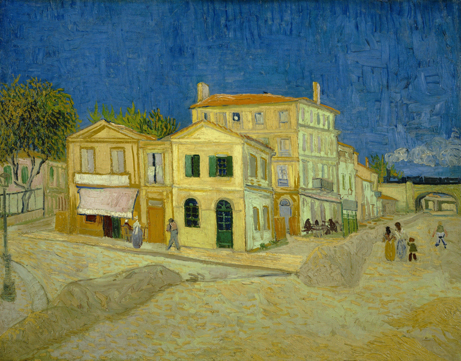
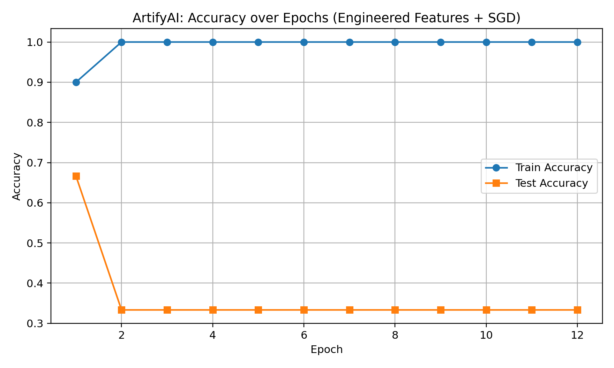

ArtifyAI — Neural Style Transfer (AVIF-ready)

Turn any image into art using classic Neural Style Transfer (NST) with VGG-19 — including .avif inputs. This repo/script is notebook-friendly, GPU-optional, and includes fixes for PyTorch in-place ReLU issues.

✨ What you get

Works with AVIF (via pillow-avif-plugin) + JPG/PNG/WebP/TIFF

Neural Style Transfer (Gatys et al.) using torchvision VGG-19

One cell notebook script and a CLI variant

Multiple style blending (e.g., 70% Van Gogh + 30% Hokusai)

Optional color preservation (match content color mood)

Robust autograd (all VGG ReLUs set to inplace=False)

📁 Suggested folders (Windows)
C:\Users\sagni\Downloads\Artify AI\
├─ archive\                 # put style reference images here (paintings, etc.)
├─ outputs\                 # stylized results are saved here
└─ flat-lay-acrylic-paint-background_23-2149127621.avif   # example content

🧰 Requirements

Python 3.9–3.12

PyTorch + torchvision

Pillow (with AVIF support via plugin)

NumPy

Install
pip install torch torchvision pillow pillow-avif-plugin numpy

If you don’t have AVIF images, the pillow-avif-plugin is optional.
If you do have AVIF, install it so Pillow can open .avif files.

⚙️ Quick Start (Notebook)

Open a Jupyter notebook.

Paste the single-cell script you received (the one titled Artify an AVIF image via Neural Style Transfer).

Update these variables if you like:

CONTENT_PATH = r"C:\Users\sagni\Downloads\Artify AI\flat-lay-acrylic-paint-background_23-2149127621.avif"
STYLE_SEARCH_DIR = Path(r"C:\Users\sagni\Downloads\Artify AI\archive")  # auto-picks a style inside this folder
OUT_DIR = Path(r"C:\Users\sagni\Downloads\Artify AI\outputs")

Run the cell.
The output will be saved as something like:

C:\Users\sagni\Downloads\Artify AI\outputs\artified_flat-lay-acrylic-paint-background_23-2149127621_with_<style>.png

No style images? The script falls back to using the content as style (effect will be minimal). Add some paintings to archive/ for dramatic results.
.
🖥️ CLI (optional)

If you prefer running from a terminal, save this as artify_nst.py:

python artify_nst.py ^
  --content "C:\Users\sagni\Downloads\Artify AI\flat-lay-acrylic-paint-background_23-2149127621.avif" ^
  --styles  "C:\Users\sagni\Downloads\Artify AI\archive\some_painting.jpg" ^
  --outdir  "C:\Users\sagni\Downloads\Artify AI\outputs" ^
  --size 768 --steps 500 --style-weight 1e6 --content-weight 1e5 --tv-weight 1e-5 --side-by-side

Blend multiple styles:

python artify_nst.py ^
  --content "C:\path\to\photo.jpg" ^
  --styles  "C:\Artify AI\archive\vangogh1.jpg" "C:\Artify AI\archive\hokusai1.jpg" ^
  --style-blend 0.7 0.3 ^
  --outdir  "C:\Artify AI\outputs" --steps 500 --size 768 --side-by-side

🔧 Key Parameters

--size / MAX_SIZE
Longest side of the image. CPU users: 512–768. GPU: 768–1024+.

--steps / STEPS
Optimization steps. 300–700 is a good range. More = better (slower).

--style-weight, --content-weight
Higher style weight = more stylized; higher content = more faithful to the original.

--tv-weight
Total variation (smoothness). Increase to reduce grain (e.g., 1e-4).

--lr
Adam learning rate. Reduce (e.g., 0.01) if you see artifacts.

🧪 Output Artifacts

artified_<content>_with_<style>.png – the stylized image

(CLI with --side-by-side) side_by_side_<content>_with_<style>.png – comparison

🧠 How it works (very short)

We use VGG-19 pretrained on ImageNet as a fixed feature extractor.

Content loss matches deep features of the content image (structure).

Style loss matches Gram matrices of deep features (texture/brush strokes).

We optimize the pixels of the output image to minimize these losses + TV smoothing.

We set all VGG ReLUs to inplace=False to avoid PyTorch autograd errors in style-transfer loops.

🐢 Performance tips

On CPU: use --size 512 and --steps 300–500.

On GPU: larger sizes (e.g., 1024) and more steps are fine.

If you run out of RAM/VRAM: lower --size.

🧯 Troubleshooting

“In-place operation modified a variable” / AsStridedBackward0
Fixed by replacing all nn.ReLU in VGG with nn.ReLU(inplace=False) (already done).

AVIF won’t open
Install the plugin: pip install pillow-avif-plugin. Restart the kernel.

Huge/slow downloads for VGG weights
The first run downloads ~548 MB to your Torch cache. It’s normal and cached afterward.

Results too noisy
Increase --tv-weight (e.g., 1e-4) and/or --steps. Lower --lr slightly.

📦 requirements.txt (example)
torch
torchvision
pillow
pillow-avif-plugin
numpy

(If you don’t need AVIF, you can omit pillow-avif-plugin.)

🙏 Acknowledgements

Neural Style Transfer — Gatys et al., 2016: “Image Style Transfer Using Convolutional Neural Networks”.

VGG-19 feature extractor from torchvision.models (ImageNet-pretrained).
Author

SAGNIK PATRA
